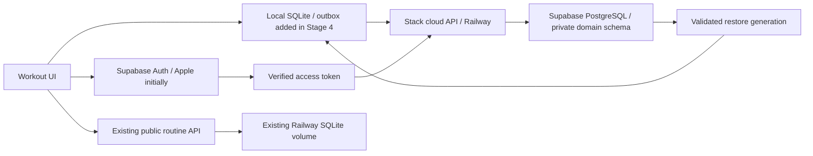

# Architecture comparison

Status: proposed decision, based on repository discovery and official documentation checked 2026-10-08. No production configuration was inspected or changed in this investigation.

## What Stack actually has

`server/package.json` runs dependency-free Node ≥22.13. `server/src/app.mjs` implements routine parsing, public snapshot creation/reading, preview HTML, AASA and health routes using `node:http`. It already has request IDs, bounded bodies, a consistent `{error:{code,message},requestId}` envelope, per-process/per-address rate limiting, timeouts and redacted logs. The optional `x-stack-client-key` is an application gate, not user identity or ownership authorization.

`server/src/routineShareStore.mjs` stores canonical public routine snapshots in SQLite with WAL, FULL synchronization, immutable update/delete triggers and 128-bit random identifiers. `server/src/config.mjs` requires an absolute durable mount path in Railway. `server/README.md` and `docs/routine-sharing-universal-links.md` record deployment on a single replica and `/data` on 2026-10-06. Earlier README statements that no database was found describe the initial investigation; the later deployment record supersedes them. These are repository records, not a fresh check of infrastructure state. They do not establish that scheduled backups are enabled or restorable.

The sharing guide also records Vercel path proxies/static AASA assets and unresolved branded-domain configuration. Cloud account endpoints need their own verified API origin; do not make restore depend on those unresolved website routes. The app has no backend workout-history store in this server. Root `package.json` already lists `@supabase/supabase-js`; a dependency entry alone is not evidence of configured authentication or cloud persistence. Existing persistence tests cover public share reopening, collision handling, validation, redaction and error handling; they do not establish user isolation or backup correctness.

## Recommendation

Choose **Option B: Supabase Auth and PostgreSQL, behind a dedicated stateless Stack cloud API on Railway**. Retain the existing routine server and its attached volume. Reuse its conventions and pure validation patterns, not its public authorization semantics. The new cloud service is a separate service/deployment unit in the same repository; it does not need its own repository, microservice mesh or queue broker.

This combines an owned, portable SQL domain model with a managed identity lifecycle and a controlled transaction boundary for backup receipts, ordering, idempotency and writer fencing. Local SQLite remains the immediate authority for user actions. Neither managed auth nor database hosting supplies the SQLite synchronization protocol.

The phone talks directly to the managed Auth endpoints for the selected provider flow. Workout data goes through Stack's API; do not expose arbitrary table writes to mobile clients. Use a restricted database role, ownership constraints/RLS and transaction-local owner context; the API must verify claims and map identity to Stack's independent account UUID. Keep privileged identity administration separate from ordinary workout transactions. Details live in [identity/security](03_IDENTITY_AND_SECURITY.md) and [data model](04_CLOUD_DATA_MODEL.md).

Use a bounded persistent Postgres connection pool with verified TLS. Choose direct connection when the deployed network supports it, or session pooling where required. Confirm connectivity and region pairing in staging; do not assume both vendors have a shared private network. Supabase documents the connection-mode tradeoffs and certificate verification. [Connection guide](https://supabase.com/docs/guides/database/connecting-to-postgres)

## Three viable choices

| Criterion | A: Railway API + Railway PostgreSQL + managed OIDC broker | B: Supabase Auth/Postgres + Railway cloud API | C: CloudKit private database + native bridge |
|---|---|---|---|
| Repository fit | Reuses backend practices; adds PostgreSQL and identity broker | Same backend practices; integrated identity/database administration | Requires Swift/Expo bridge and CKRecord mapping alongside current SQLite |
| Implementation complexity | High: app protocol plus broker and DB operational integration | Medium-high: same correctness work; fewer auth/DB components to assemble | Medium for Apple-only backup, high for provider-independent accounts and current relational graph |
| Costs | Resource-based DB/API plus selected broker and backup storage | Paid baseline + PITR; usage modeled in document 08 | Private records consume user's iCloud quota; public quota/pricing not relied on |
| Portability | Excellent SQL portability; broker-specific session migration | Excellent domain SQL portability; Auth migration remains work | Export required; CKRecord/change-token mapping is provider-specific |
| Provider flexibility | Broker can support Apple/Google | Apple and Google design supported; Apple-only initial launch pending linking proof | iCloud identity controls private storage; Google sign-in cannot replace it |
| Offline operation | Stack must implement SQLite outbox/recovery | Stack must implement SQLite outbox/recovery | CKSyncEngine helps scheduling/retries; SQLite integration still required |
| Conflicts | Owned application policy and revisions | Owned application policy and revisions | Application-specific conflicts still need handling |
| Security responsibility | Stack: claims, ownership, broker setup, SQL policies, recovery operations | Stack: claims, ownership, policies, managed-service setup, recovery operations | Apple handles private-cloud access; Stack owns local account transitions, integrity and export |
| Observability | SQL/API metrics and operational access; configure recovery visibility | SQL/API plus auth dashboards; product correctness metrics still custom | Device errors and CloudKit diagnostics; less central visibility into private records |
| Lock-in | Low domain storage; moderate broker integration | Moderate auth/platform tooling; low ordinary Postgres domain storage | High record API, account and entitlement integration |
| Maintenance | More explicit DB and identity integration ownership | Two vendors, but managed auth/DB reduce bespoke maintenance | Less hosted backend, more specialized native work |
| Cross-platform | Straightforward API clients | Straightforward API clients | Web APIs exist; Apple account and native-sync coupling remain |
| Migration risk | Local ID/ownership/history conversion is main risk | Same local migration risks; no existing cloud history to convert | Same local risks plus native bridge and CloudKit record graph |
| Private social features | Explicit grants and account relations fit SQL | Explicit grants and account relations fit SQL | CloudKit sharing supports iCloud users; different product constraints |

### Option A is credible, not disqualified by obsolete platform claims

Railway now documents maintained database templates, security image updates, configurable PITR, HA, pooling and major-version workflows. Users enable recovery/HA, size storage and own schemas/data. Changes outside the template's supported configuration can shift engine management responsibility to the user. It is incorrect to dismiss Railway as lacking PITR or all managed operations. [Railway responsibilities](https://docs.railway.com/databases), [PostgreSQL](https://docs.railway.com/databases/postgresql)

A uses a standards-based managed identity broker, not custom OAuth refresh-token cryptography. Supabase Auth alone could be that broker, but placing identity on Supabase and domain data on Railway adds a database boundary without a demonstrated benefit at Stack's scale. A is the fallback if region requirements, operational experience or measured cost favor Railway PostgreSQL. Its SQL cloud protocol can stay the same.

### Option B reduces assembly, not correctness work

Supabase's paid backup/auth combination is useful to a small team protecting private history. The strongest argument is the owned API boundary and ordinary relational constraints, not direct table APIs or popularity. Supabase Realtime notifications would only be later hints to fetch committed changes; they are not the durable synchronization log, conflict resolver or restore manifest.

Costs and liabilities: two providers can fail independently, network calls cross providers, egress can be billed on both legs, and regional latency needs measurement. A managed backup protects infrastructure, not a mistakenly accepted delete or wrong-owner write. Domain constraints, tested restores, operator access and deletion policy remain Stack's responsibility. Direct-to-Supabase RPC/Edge Functions is a valid alternative but moving backend execution adds migration work without removing the protocol requirements.

### Option C is attractive only under a different product decision

Apple documents private-cloud data against the user's iCloud quota and requires an active iCloud account for private access. CloudKit is distinct from Sign in with Apple: signing into a Stack account is not authorization to an arbitrary iCloud private database. CloudKit JS/Web Services exist, so “CloudKit has no web access” would be false. [Apple design guide (archived)](https://developer.apple.com/library/archive/documentation/General/Conceptual/iCloudDesignGuide/DesigningforCloudKit/DesigningforCloudKit.html), [CloudKit overview (archived)](https://developer.apple.com/library/archive/documentation/DataManagement/Conceptual/CloudKitQuickStart/Introduction/Introduction.html)

CKSyncEngine schedules synchronization and retries some transient errors, but requires persisted engine state and delegates, has indeterminate background scheduling, and leaves application conflicts/account changes to the app. It does not synchronize public databases. These documented behaviors suit an Apple-only personal-data product but do not eliminate Stack's transactional SQLite work. [Current CKSyncEngine reference](https://developer.apple.com/documentation/cloudkit/cksyncengine-4b4w9?language=objc), [Apple sample](https://github.com/apple/sample-cloudkit-sync-engine)

CloudKit is rejected here because provider-independent Stack ownership, Google identity, eventual cross-platform access and explicit coach/friend grants are stated requirements. If the founder instead commits to iCloud-only recovery and Apple-only accounts, re-evaluate it before implementation. Do not implement both cloud systems: double ownership, double conflict handling and ambiguous backup status would be worse.

## Decision boundaries and proof required

1. Approve B and a region/retention budget before provisioning. Apple-only initial identity is conditional on the security/linking decisions in document 03.
2. Prove the restricted API role cannot access another account, including through pooled-connection reuse, restores and deletion jobs.
3. Prove physical-device authentication/reinstall and a representative historical SQLite round trip before promising backup.
4. Benchmark cross-provider TLS/connectivity and bounded batch transactions. Keep a portable SQL migration/export path.
5. Prove PITR and independent export restores. A product backup receipt and operator disaster recovery are distinct guarantees.
6. Leave public routine snapshots separate. Their current triggers prohibit deletions and they have no account association; a later revocation policy requires its own reviewed migration.

No automatic multi-device merge, cross-device live workout, Realtime dependency, multi-region writes, custom identity server or CRDT is required for the initial release.
