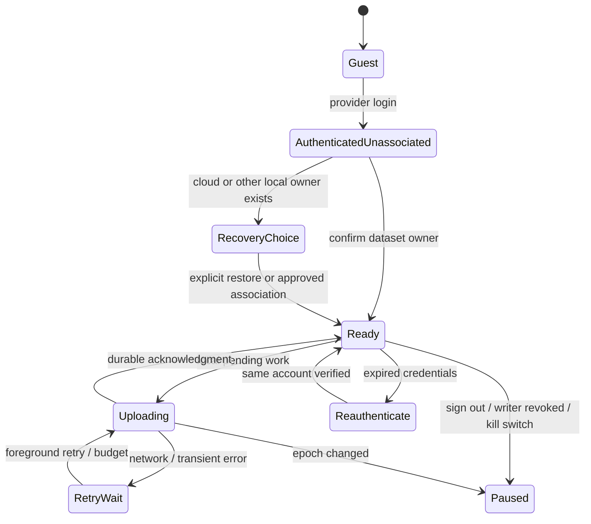

# Synchronization protocol

Proposed v1 contract; implementation follows verified backup/restore, not the other way around. Local SQLite is the authority for unacknowledged work. A verified cloud checkpoint is the authority for recovery of acknowledged backup scope. Never overwrite either on ambiguous ownership.

## Five separate capabilities

| Capability | Meaning | Stage |
|---|---|---|
| Local persistence | SQLite commit survives ordinary app restart on this device | Already exists |
| Cloud backup | Immutable, server-validated point-in-time recovery copy | 2 |
| Cloud restore | Verified copy materialized into a local database and activated safely | 3 |
| One-device synchronization | One authorized writer incrementally updates cloud current state; replacement device must take over explicitly | 4 |
| Bidirectional multi-device synchronization | Multiple devices create/edit data, exchange changes and resolve conflicts | 5, separate release |

Stage 2–3 first release is manual snapshot backup plus foreground reminders when stale. It does not promise automatic updates. Stage 4 retains verified checkpoints even when incremental current state is newer. “Last verified backup” advances only after checkpoint validation; an operation acknowledgment alone does not update that label.

## Account and worker state



One worker per local dataset; each attempt captures immutable `(owner,dataset,account_epoch,device_id,fence)` and verifies these before reading credentials, sending and applying the response. On sign-out stop scheduling, increment epoch, cancel best-effort requests, revoke backend device upload permission when online, and destroy access tokens. An already committed request for the former owner may finish; never apply its receipt or data to another namespace. Offline sign-out cannot retract a request already received by the server; the app reports that last known state honestly.

The device fence is server-controlled, incremented under a dataset lock on takeover, deletion, cloud reset or device revocation. Every write and finalization supplies it; stale fences receive 409 `WRITER_REVOKED`. Do not use expiring wall-clock leases: an offline phone can continue logging indefinitely, but needs reconciliation before cloud ownership changes. A reinstall cannot silently seize the writer role.

## Local transaction and outbox (Stage 4)

Route all persistent mutation entry points through the same local unit of work: completion, profile updates, note add/delete, exercise rename, split save/reorder/delete, imports, history deletion/reset and file restore. See `store/workoutDatabase.ts`, `features/import/persistence.ts`, `store/splitImport.ts` and `features/settings/data.ts`. Store-level subscriptions miss writes and are not sufficient change capture. Active set edits are local only initially; completing a workout atomically creates its aggregate outbox entry.

```text
SQLite BEGIN
  apply domain change (existing local integer IDs remain)
  allocate any missing cloud IDs
  increment dataset local_generation
  if associated and cloud mutation tracking enabled:
    append immutable operation(op_id, aggregate_id, generation,
      desired aggregate payload, expected server revision, account epoch)
SQLite COMMIT
publish local UI state
schedule worker (network never occurs in this transaction)
```

For guest/unassociated datasets, increment a cheap local dirty generation once cloud metadata exists; never upload automatically on login. Full backup includes all eligible rows, not just a pre-login queue. Tracking failure caused by a cloud metadata defect must pause cloud tracking, set a persistent `requires_full_rescan` marker and preserve the workout through a tested local-only transaction; it must never silently skip change capture while leaving backup status current. Ordinary disk-full/SQLite failures still mean the local save failed and must be surfaced. Stage 4 release requires fault tests for this fallback and a startup generation/hash reconciliation. Network failure has no bearing on either transaction.

Keep immutable in-flight operations. Coalesce only not-yet-sent successors under the same transaction; no response can acknowledge a newer generation than it submitted. Multiple edits to the same aggregate form a dependency chain: dispatch one at a time, assign the next operation's base revision only when sealing it for first send, and persist that sealed body/hash before sending. Rebase after an intervening inbound revision requires explicit conflict handling. Completion aggregate includes imported-workout facts where present. Profile depends on selected split; split depends on referenced exercise definitions; deletion emits reference detachments atomically. Import marker closes only when all its aggregates are acknowledged.

## Endpoint contracts

All `/v1/cloud` endpoints use TLS, verified bearer + account gate, request correlation ID, protocol version, size/time limits, owner-scoped authorization and opaque identifiers. Error responses extend the existing server convention: `{error:{code,message,retryable,details},requestId}`; never echo notes, tokens or existence of another user's IDs. Mutation acknowledgments are sent only after their PostgreSQL transaction commits. A 202 response acknowledges a durably queued validation job, never a completed backup; only a committed manifest receipt has that meaning.

| Method/path | Request / response |
|---|---|
| `POST /account/resolve` | approved provider proof → internal user ID + account state, no data movement |
| `POST /devices` | idempotency key, installation ID/label → device and capability set |
| `GET /datasets/current` | summary of authorized dataset/last verified backup, writer status, supported formats; no owner lookup by email |
| `POST /datasets/associate` | local dataset UUID + explicit consent + expected empty account revision → owner binding and writer fence; racing creation 409 |
| `POST /devices/takeover` | recent auth, confirmed restore manifest, expected writer fence → incremented fence; displaced device writes fail |
| `POST /backups` | request_id, dataset/fence, immutable manifest proposal, counts, chunk hashes, local generation → upload_id + missing ordinals + expiry |
| `PUT /backups/{id}/chunks/{ordinal}` | canonical bytes with SHA256 → exact stored hash; equal retry 200; different bytes 409 |
| `POST /backups/{id}/finalize` | manifest hash + fence → 202 validating or 200 committed receipt; repeated finalization returns same receipt |
| `GET /backups/{id}` | state, missing chunks, failure category or immutable receipt |
| `GET /backups` | only committed checkpoints are offered for restore; current owner only |
| `POST /restores` | manifest_id, device_id → pinned restore ID and manifest; no writable takeover yet |
| `GET /restores/{id}/chunks/{ordinal}` | authorized immutable chunk bytes and hash |
| `POST /sync/push` | dataset/fence, operation_id, base_revision, payload_version, aggregate, request_hash → operation_id, revision, committed sequence, canonical hash |
| `GET /sync/changes?cursor=...&limit=...` | signed/opaque cursor → atomic change envelopes + next_cursor + has_more + history_epoch |
| `POST /sync/checkpoints` | requested source revision → async immutable snapshot; status then receipt |
| `POST /account/export`, `DELETE /account` | recent auth for delete; asynchronous job ID/status, separate from device data removal |

Backup soft target: 256 KiB canonical uncompressed chunks; 1 MiB HTTP request ceiling; max 256 MiB uncompressed dataset for initial service with an actionable over-limit state, no truncation. A single aggregate can use multiple transport chunks but applies atomically. Allow at most 2 chunks in flight and a bounded decompression ratio. These are proposed starting limits requiring large-history validation. No hard 500-workout limit. Stage 4 cap pushes at 50 aggregate operations/1 MiB; an oversized aggregate uses the same staged transport with atomic finalization. No unbounded JSON parsing on the UI thread/server event loop.

## Server mutation transaction

```text
BEGIN
  SET LOCAL verified_owner = server_resolved_owner
  SELECT writer_state FOR UPDATE
  verify user active, dataset, device and current fence
  if receipt(op_id) exists:
     require stored_request_hash == incoming_hash; return stored result
  require supported contract; validate payload + ownership of all references
  require base_revision == aggregate.current_revision (0 only for new ID)
  reject tombstoned ID recreation
  apply complete aggregate; run relational + semantic validation
  revision = previous_revision + 1
  seq = writer_state.next_change_seq + 1  // transactional row counter
  write change_log(seq, complete aggregate including related detachments)
  write operation_receipt(op_id, hash, revision, seq)
  update writer_state counter
COMMIT
return receipt
```

New UUID already present with different provenance/payload is `ID_COLLISION`, never overwrite. Request ID reused with altered payload is `IDEMPOTENCY_MISMATCH`. Unknown old operation IDs remain guarded by base revisions/tombstones even after future receipt compaction. No timestamps choose winners. Per-dataset serialization is cheap for a single human writer and prevents sequence allocation/commit races. [PostgreSQL sequence documentation](https://www.postgresql.org/docs/current/functions-sequence.html) explains why a plain sequence is not a transactional watermark.

Batches are **per-aggregate atomic**, not best-effort individual rows. Return a result for each attempted operation; failed dependencies are `DEPENDENCY_BLOCKED`. Client deletes only individually acknowledged outbox rows in the same SQLite transaction that stores the receipt/revision. Missing response means retry exact operation ID. Never mark a whole batch clean because HTTP returned 200.

## Inbound application

Stage 4 primarily needs inbound restore/reconciliation and server canonical revisions, even with one writer. Feed rows contain immutable payload at that sequence; do not resolve an old event to today's mutable row. The server chooses a high watermark under the same counter lock and returns `(cursor,H]` in order, paging without splitting an aggregate. Cursor encodes user/dataset/history_epoch/sequence/protocol and is authenticated; server checks its owner and bounds.

```text
download and validate page
SQLite BEGIN
  recheck owner/account_epoch/history_epoch
  for envelope in ascending sequence:
    ignore already-applied sequence/revision with same hash
    if locally dirty and not echo of acknowledged operation: save conflict; stop before it
    apply full aggregate through restore adapter (do not generate a new outbox echo)
    update ID map, entity revisions and tombstones
  foreign_key_check + affected aggregate validation
  advance cursor to last fully applied envelope only
SQLite COMMIT
reload affected local projections
```

Never advance past an unapplied conflict. Stage 4 treats unexpected remote concurrent edits as blocked reconciliation, not automatic merge. Duplicate same revision/different hash is a consistency incident. With a local pending operation whose response was lost, query/retry its receipt before deciding an inbound echo conflicts. Page download need not hold a SQLite transaction.

410 `CURSOR_EXPIRED`/`HISTORY_RESET` fetches a pinned verified snapshot into staging. Preserve dirty local data and its queue; do not overwrite it during reset. If dirty work has no provable base after server disaster recovery, retain a local recovery branch and require reviewed reattachment/export. A provider PITR rollback requires new history_epoch and fence, reconciliation of deletion ledger, then client reset; do not continue old sequence numbers as though nothing happened.

## Conflict policy by category

| Category | Stage 2–4 | Future Stage 5 |
|---|---|---|
| Completed workouts | Aggregate CAS; owner/device fence; reject conflicting edit and preserve local copy | Disjoint new UUIDs union; conflicting same-workout edits require user choice/version history |
| Active workout | Device-local, excluded; logging still works on displaced device | Explicit transfer/handoff; two active sessions cannot fit today's unique index without redesign |
| Individual sets | Included atomically with workout, never fieldwise weight/reps merges | Consider set-level revision only if UX warrants; never mix weight from one edit and reps from another |
| Custom splits/order | Whole split CAS including ordered children | Fork/choose conflicting routine versions; no positional LWW |
| Exercise definitions/notes | CAS; notes separate; references required | Additive notes union by UUID; rename conflicts explicit (names affect PR identity today) |
| Profile/preferences | Singleton or per-key CAS; no clocks as authority | Per-key server revisions with documented user choice for training plan conflicts |
| Deletes | Tombstone rejects stale resurrection; session deletion detaches notes; old checkpoints contain recoverable prior state per retention | Delete/edit conflict surfaces local copy; restoration creates new identity only on explicit action |
| Progression/PRs/Build | Recompute with pinned derivation contract, never upload derived scores | Same; cross-device timezone/rule version semantics need product decision |

## Retry and execution rules

- Retry network/408/429/5xx with exponential backoff and full jitter: about 1s → 5m ceiling; honor Retry-After. Bounded attempts per foreground cycle, persisted retry state, manual Retry available. Time is scheduling only.
- 401: one serialized refresh, then reauthentication. 403: stop and re-resolve ownership. 409: classification-specific reconciliation. 413/422: permanent item block with actionable explanation, no infinite retry. 426: cloud update required, offline still usable.
- Schedule after completion/settings commit, app foreground, connectivity return and explicit Backup now. Background tasks are opportunistic only. [Expo BackgroundTask](https://docs.expo.dev/versions/latest/sdk/background-task/) documents OS-controlled timing and stopped tasks after user termination; physical devices must verify behavior.
- Snapshot creation must yield or use SQLite's consistent backup mechanism; do not stringify years of history in a UI blocking transaction. [Expo SQLite](https://docs.expo.dev/versions/latest/sdk/sqlite/) notes transaction scope hazards with async APIs. Use exclusive transaction handles or the existing serialized synchronous unit of work for short operations; never await network inside a transaction.
- Server kill switches can reject new writes while preserving reads/restore and local writes. Stale feature flags default to safe local-only mode. Pending operations remain durable. Expiring uploads may be garbage-collected after 7 days; restart from frozen local snapshot with a new upload ID.
